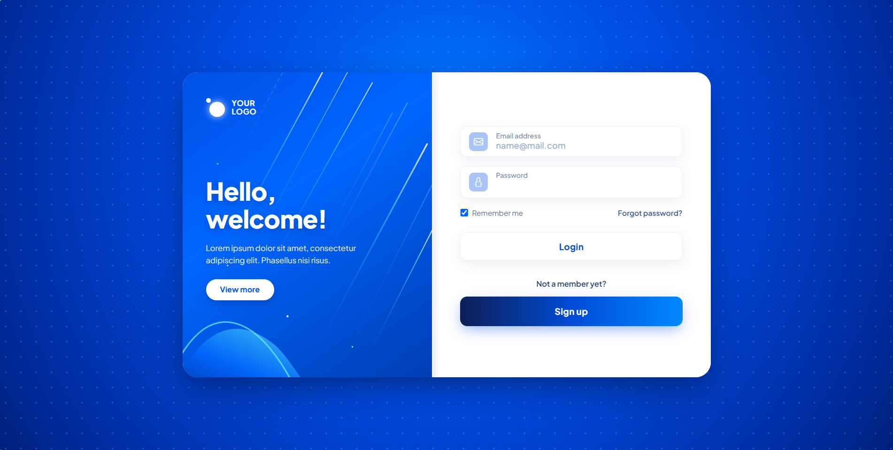

# DESIGN-BY-BUNNY
# 🔐 Login & Sign Up Card UI

A modern and responsive **Login & Sign Up Card UI** designed with a clean split-screen layout, vibrant blue gradients, smooth animations, and interactive JavaScript functionality.

This project is built as a frontend authentication UI and can be easily extended with a backend authentication system in the future.

---

## ✨ Features

* 🔐 Modern Login Form
* 📝 Sign Up Interface
* 📧 Email Address Input
* 🔑 Password Input
* ☑️ Remember Me Option
* 🔄 Forgot Password Interaction
* ⚡ Login Loading Animation
* 🔔 Custom Toast Notifications
* 🎨 Modern Blue Gradient Design
* 🌊 Custom SVG Background Graphics
* ✨ Smooth Hover & Button Animations
* 📱 Fully Responsive Layout
* 💻 Desktop, Tablet & Mobile Support

---

## 🛠️ Technologies Used

* **HTML5** — Page structure
* **CSS3** — Styling, gradients, animations & responsive design
* **JavaScript** — User interactions and toast notifications
* **Bootstrap 5.3.3** — Responsive utilities and components
* **Bootstrap Icons** — UI icons
* **Google Fonts** — Inter & Plus Jakarta Sans
* **SVG** — Custom graphical effects

---

## 📂 Project Structure

```text
login-signup-card/
│
├── index.html
├── style.css
├── script.js
├── screenshot.png
└── README.md
```

### File Description

| File             | Description                                                 |
| ---------------- | ----------------------------------------------------------- |
| `index.html`     | Main HTML structure of the login/signup interface           |
| `style.css`      | Custom styling, gradients, animations and responsive design |
| `script.js`      | Login, signup, forgot-password and toast interactions       |
| `screenshot.png` | Project preview image                                       |
| `README.md`      | Project documentation                                       |

---

## 🎨 Design

The interface uses a **split-card authentication layout**.

### Left Section

The left panel includes:

* Brand/logo section
* Welcome message
* Supporting text
* View More button
* Electric blue gradient background
* Custom SVG light streaks
* Decorative wave graphics

### Right Section

The right panel contains:

* Email input
* Password input
* Remember Me checkbox
* Forgot Password link
* Login button
* Sign Up button

---

## ⚡ JavaScript Functionality

The project includes interactive frontend functionality.

### Login

When the user clicks **Login**:

1. The form submission is prevented.
2. A loading spinner is displayed.
3. The button changes to `Logging in...`.
4. After a short delay, a success toast notification appears.

### Sign Up

Clicking the **Sign Up** button displays a registration notification.

### Forgot Password

Clicking **Forgot password?** displays a password recovery notification.

### View More

Clicking **View more** displays a feature exploration notification.

---

## 📱 Responsive Design

The layout is responsive and adapts to different screen sizes.

### Desktop

```text
┌────────────────────┬────────────────────┐
│                    │                    │
│   Welcome Panel    │    Login Form      │
│                    │                    │
│   Blue Gradient    │    Email           │
│   SVG Graphics     │    Password        │
│                    │    Login           │
│                    │    Sign Up         │
└────────────────────┴────────────────────┘
```

### Mobile

```text
┌─────────────────────────┐
│                         │
│     Welcome Panel       │
│                         │
├─────────────────────────┤
│                         │
│      Login Form         │
│                         │
│      Email              │
│      Password           │
│      Login              │
│      Sign Up            │
│                         │
└─────────────────────────┘
```

---

## 🚀 How to Run

### 1. Clone the Repository

```bash
git clone https://github.com/your-username/login-signup-card.git
```

### 2. Open the Project

```bash
cd login-signup-card
```

### 3. Run the Project

Open `index.html` directly in your browser.

For development, you can use **Live Server** in Visual Studio Code.

No `package.json` or npm installation is required because this is a frontend HTML/CSS/JavaScript project.

---

## 🌐 External Resources

The project uses CDN resources for:

* Bootstrap 5.3.3
* Bootstrap Icons
* Google Fonts

An internet connection may be required for these external resources to load correctly.

---

## ⚠️ Current Project Status

This project currently represents a **frontend authentication UI**.

The Login, Sign Up and Forgot Password functionality is simulated on the client side. There is currently no:

* Backend authentication
* Database
* User registration API
* Real password recovery
* User session management

---

## 🔮 Future Improvements

Possible future improvements include:

* 🔐 Real authentication system
* 🗄️ Database integration
* 🔗 Backend API integration
* 👤 User registration
* 🔑 Real password reset
* 👁️ Password visibility toggle
* ✅ Advanced form validation
* 🔒 JWT authentication
* 🌐 Social login
* 🌙 Dark mode
* 👤 User session management

---

## 📸 Preview

Add your project screenshot to the repository as:

```text
screenshot.png
```

Then display it in this README using:

```markdown

```

---

## 👨‍💻 Author

**Deepesh**

Frontend Login & Sign Up UI project built with HTML, CSS, JavaScript and Bootstrap.

---

## 📄 License

This project is created for learning, development and portfolio purposes.
